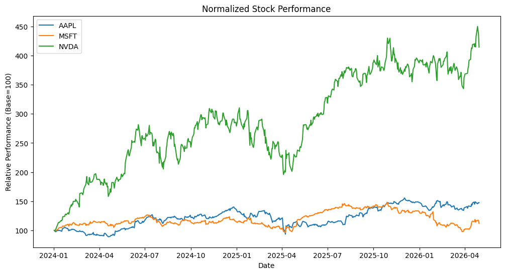
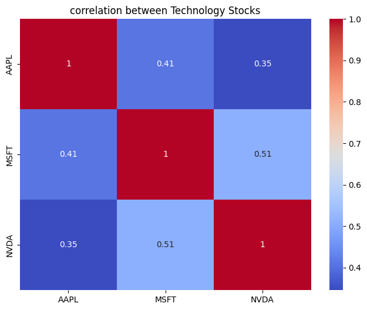
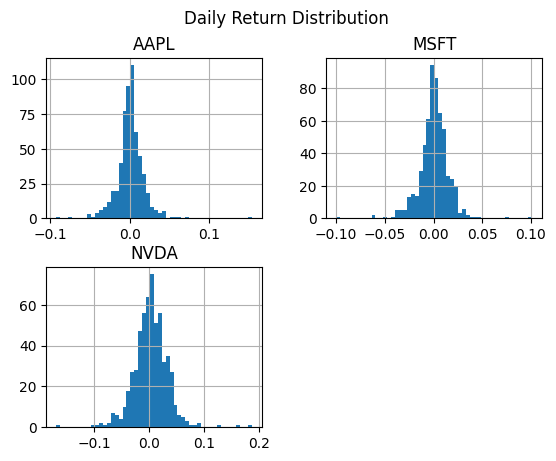
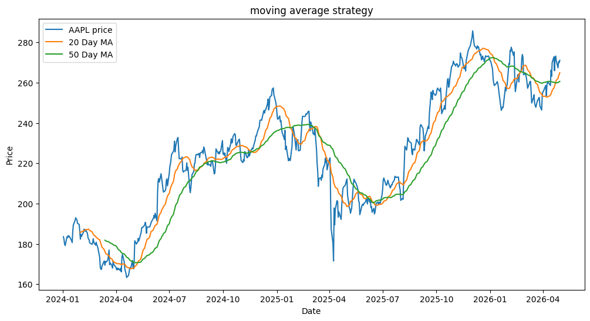
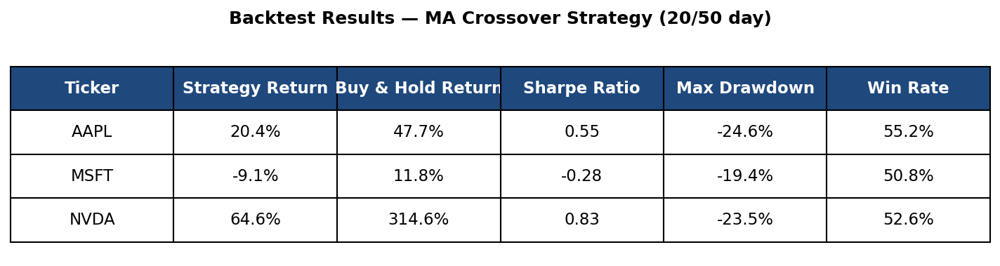

# Technology Sector Equity Analysis

## Overview
This project analyzes historical stock data from the Technology sector using:

- Apple (AAPL)
- Microsoft (MSFT)
- NVIDIA (NVDA)

## Objectives

- Identify patterns and anomalies in stock performance
- Build a simple trading strategy
- Backtest the strategy
- Evaluate risks and limitations

---

## Key Findings

### Pattern 1: NVIDIA Outperformance

NVIDIA significantly outperformed Apple and Microsoft while also exhibiting higher volatility.

---

### Pattern 2: Correlation Analysis

Technology stocks demonstrated moderate positive correlation.

---

### Pattern 3: Volatility Analysis

NVIDIA showed a wider return distribution, indicating greater volatility.

---

## Trading Strategy

### Moving Average Crossover Strategy

Buy Signal:

- 20-day MA > 50-day MA

Sell Signal:

- 20-day MA < 50-day MA

Reasoning:

The strategy assumes short-term price trends react faster than long-term trends. A crossover may indicate a shift in market momentum.

---

## Backtest Results

The strategy was compared against a Buy-and-Hold approach.

### Backtest Insights

- NVDA Buy-and-Hold returned **314.6%**, while the strategy returned **64.6%**
- MSFT generated a negative strategy return (**-9.1%**) due to false crossover signals
- The strategy struggled during volatile and sideways market conditions
- Results suggest MA crossover strategies may perform better on smoother long-term trends than highly momentum-driven stocks

---

## Tools Used

- Python
- Pandas
- Matplotlib
- Yahoo Finance API
- Jupyter Notebook
